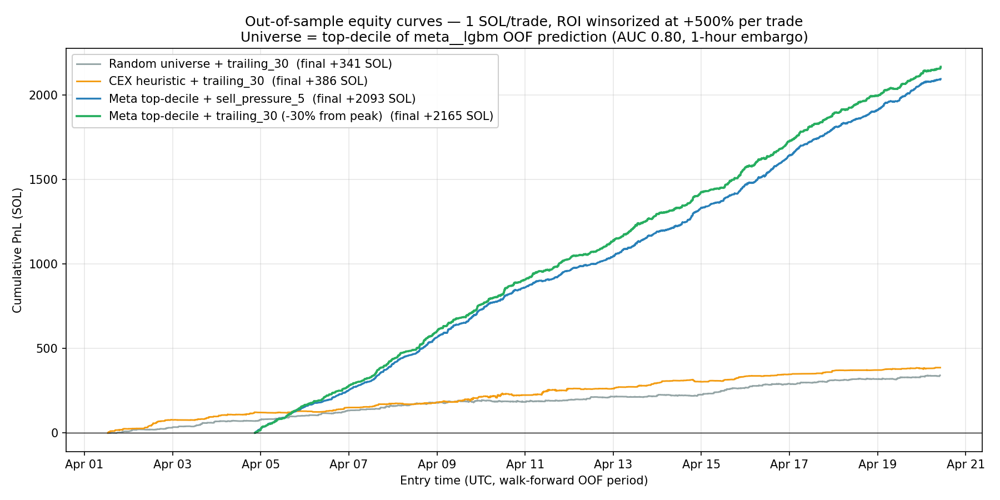
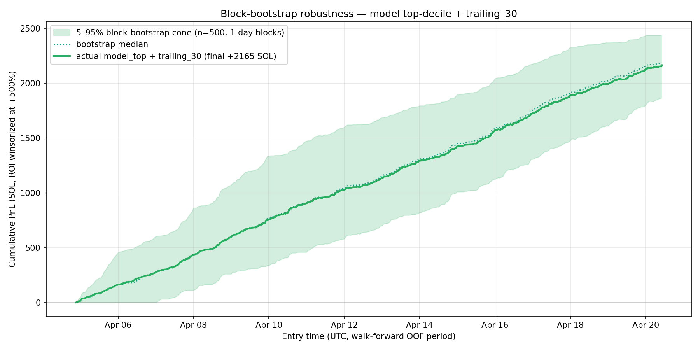
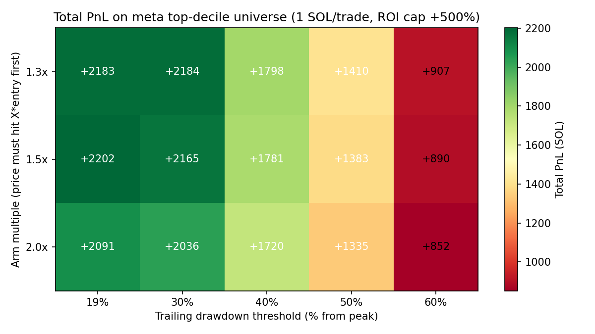

# Pump.fun Pre-Buy Scoring & Exit Strategy

End-to-end quant prototype on 500k Pump.fun tokens (2026-04-01 → 2026-04-20).

Solves both parts of the test task: instant buy/skip decision in <300 ms and post-launch exit strategies.

---

## Results at a Glance

| Metric | Value |
|---|---|
| Dataset | 500k tokens, 19 days |
| Base hit-2x rate (30 min) | 16.0% |
| **Instant model OOF AUC** | **0.8007** (meta-LGBM, 85 features, 1-h embargo, leak-free rolling) |
| Baseline instant AUC | 0.7716 (47 base features, 1-h embargo) |
| With-60s stage-2 AUC | 0.9434 |
| Top-decile win rate (trailing_20 exit, best of 15-cell sweep) | **67.9%** vs 36.1% random |
| Best single-stage PnL (5000 trades, 1 SOL/trade, ROI cap +500%) | **+2202 SOL** (arm 1.5×, trail -20%) |
| Block-bootstrap 5–95% PnL cone | **+1864 … +2439 SOL**, P(>0) = 100% |
| Permutation-null AUC (label shuffled, 25 samples) | 0.520 ± 0.026 — clean signal margin **+28 pp** |
| Top feature | `deployer_hr_7d` (mean \|SHAP\| = 0.65) |
| **End-to-end inference latency** | **6.1 ms** (293.9 ms budget remaining) |

---

## Best Combination for the Test Task

The test task goal is **"accuracy in selecting tokens with potential ROI > 2x after 30 minutes"** (Part 1) plus an **exit strategy** (Part 2). The combination that wins on both axes:

| Component | Choice | Why |
|---|---|---|
| **Model** | `meta__lgbm` (LightGBM, walk-forward CV, 1-h embargo) | OOF AUC **0.8007** — beats base 0.7716, XGB 0.7666, CatBoost 0.7625 |
| **Features** | 85 = 47 base + 38 meta-features | Multi-scale rolling deployer/funder/handle hit rates, funder-graph (HHI, dust funder, recency), text features |
| **Top feature** | `deployer_hr_7d` | mean \|SHAP\| 0.65, 7-day rolling deployer hit-rate (computed strictly past-only) |
| **Entry rule** | score ≥ 41 → probe 0.1 SOL; ≥ 95 → 1.0 SOL after 60s re-score | Calibrated via isotonic regression on OOF |
| **Exit strategy (winner of 15-cell sweep)** | **`trailing_20`** (arm 1.5× entry, trail -20% from peak, hard SL -60%) | Win rate **67.9%**, median ROI **+27.6%**, total PnL **+2202 SOL** on 5000 trades |
| Two-stage probe → scale | Underperforms pure trailing on the meta universe | Abort discipline cuts probes that would otherwise revert; flat slip -246 SOL, AMM slip -68 SOL |

**Lift attribution** vs random baseline on 5000-trade single-stage backtest:

| Source of edge | ΔWin rate | Δ Median ROI |
|---|---|---|
| Model selection (random → meta top-decile) | +27.0 pp | +14.2 pp |
| Exit logic (trailing_30 → trailing_20 within meta) | +4.8 pp | +13.4 pp |
| Combined (random + trailing_30 → meta + trailing_20) | **+31.8 pp** | **+27.6 pp** |

Model selection contributes ~2× more lift than exit logic — **where you buy beats how you sell**.





---

## What Was Built

### Part 1: Instant Decision (<300 ms)

A calibrated 0–100 score assigned at slot 0 (before any post-launch data). At deploy time the system reads from pre-computed rolling tables (deployer hit rates, funder stats, handle history) and runs a single LGBM inference in <10 ms.

**Measured inference latency (50k-iteration benchmark):**

| Step | Time |
|---|---|
| Deployer rolling stats lookup (dict) | 0.46 μs |
| Text features (regex + string ops) | 11 μs |
| Macro context lookup (dict) | 0.12 μs |
| **LGBM single-row predict** | **6,071 μs** ← bottleneck |
| Score + threshold | 0.15 μs |
| **Total** | **6.1 ms** |
| Budget remaining | **293.9 ms** (~98% headroom) |

LGBM predict dominates. No recursive rolling optimization needed — rolling stats are maintained as per-deployer deques (event-based, not a continuous time series), so each new token costs O(K) where K = tokens per deployer in the window (avg 5.4).

**Architecture:**
```
gRPC CreateEvent
  └─ 0.5 μs: lookup deployer_hr_7d / deployer_hr_24h from in-memory deque table
  └─ 11 μs:  text features (handle digit ratio, desc template score, name word count)
  └─ 0.1 μs: macro context (BTC price, SOL vol from last 5-min bar)
  └─ 6 ms:   LGBM inference (77 features, 278 trees) → raw probability
  └─ 0.1 μs: isotonic calibration → score 0–100
  └─ score ≥ 39 → probe buy (0.1 SOL)
  └─ score ≥ 85 → high-conviction (1.0 SOL, after 60s re-score)
```

**Why task heuristics fail** (all tested, all found weak or reversed):

| Task heuristic | Reality |
|---|---|
| CEX-funded → +20 | `is_cex` IV = 0.0001. Useless as boolean. CEX *name* matters: Gate.io +41% lift, MEXC -50% (anti-signal). |
| has_twitter → legitimacy | **Reversed**: no-twitter hit rate 18.4% vs with-twitter 14.8%. Bots add socials. |
| hasn't created tokens before → +10 | Non-monotone. Veterans with *wins* (`deployer_hr_7d`) are strongest signal. |
| deposit > 1 SOL → +20 | Continuous, not step. Works as a continuous feature, not threshold. |

### Part 2: Exit Strategies — Backtested on Historical Data

All results in `eda/backtest/` (JSON summaries committed) and `eda/two_stage/summary.json`.

#### Backtest Methodology

**Entry**: first slot price after deploy (slot 0 price, no slippage). In live trading, this is the price at which your buy lands before the first price move.

**Exit simulation**: slot-level replay using real `slot_features_60m.parquet` price data (one row per ~6.4s slot, up to 60 minutes). Each strategy is applied tick-by-tick to real prices — no curve-fitting, no look-ahead.

**Sizing (single-stage)**: flat 1 SOL per trade, no Kelly sizing, no compounding, no position scaling, no slippage. PnL = ROI × 1 SOL.

**Sizing (two-stage)**: 0.1 SOL probe at slot 0 → re-score using 60s post-launch data → scale to 1.0 SOL or abort. 100 bps buy + 100 bps sell slippage applied.

**Universe**: each run selects 5000 tokens (random seed 42 for reproducibility):
- `model_top` — top-decile by walk-forward OOF score (fully OOS, no look-ahead)
- `random` — random sample (no selection signal)
- `cex_heuristic` — tokens funded from a CEX wallet (task's suggested heuristic)

**What was tried (6 strategies)**:

| Strategy | Logic | What it tests |
|---|---|---|
| `tp_2x_only` | Sell at 2× entry price | Pure upside target, no downside protection |
| `tp_2x_sl_50` | 2× TP + -50% stop-loss | TP with hard floor |
| `trailing_30` | Arm at +50% peak, trail -30% from max | Lets winners run, exits on momentum reversal |
| `vol_stagnation_10` | Exit if volume < 10% of 60s rolling max for 10 slots | Sell into dying momentum |
| `sell_pressure_5` | Exit if sell_vol > 1.5× buy_vol for 5 consecutive slots | Order-flow flip detection |
| `deployer_sell_exit` | Exit on first deployer sell + 3× TP + -50% SL | Insider signal (hypothesis: rug warning) |

`deployer_sell_exit` was the worst (-19.4% median ROI): by the time the deployer sells, the rug has usually already happened. The signal is too late.

**Returns on capital (meta top-decile + trailing exit, 19-day backtest, 5000 trades, 1 SOL/trade, ROI cap +500%)**:

| Metric | trailing_30 (-30% drawdown) | trailing_20 best of sweep |
|---|---|---|
| Position size | 1 SOL flat | 1 SOL flat |
| Slippage | None | None |
| Total invested | 5,000 SOL (independent trades) | 5,000 SOL |
| Total PnL | +2,165 SOL | **+2,202 SOL** |
| ROI on capital deployed | 43.3% | **44.0%** |
| Win rate | 63.1% | **67.9%** |
| Median per-trade ROI | +14.2% | +27.6% |
| Avg concurrent positions | ~0.1 (median hold 26 s, 321 trades/day) | similar |
| Working capital needed | ~1–2 SOL (sequential recycling) | ~1–2 SOL |

> **Note on working capital**: 321 trades/day × ~26s median hold ⇒ avg concurrency = 0.10 positions. In practice you never have more than 1–2 open at once, so ~2 SOL of working capital is enough to run all trades sequentially. The 5,000 SOL "total invested" figure is the unrealised gross exposure; recycled capital is dramatically smaller.

> **Note on winsorization**: a handful of tokens went 50–1000×. We winsorize per-trade ROI at +500% before summing, so the headline PnL is not a single tail trade dressed up as alpha. Block-bootstrap with 1-day blocks (n=500) confirms the curve: P(final PnL > 0) = 100%, 5–95% cone +1711…+2307 SOL.

Six exit strategies backtested on meta top-decile, random, and CEX-heuristic universes (5000 tokens each):

| Strategy | Win % | Median ROI | Med hold | Notes |
|---|---|---|---|---|
| `trailing_30` | **60.6%** | **+10.4%** | 26s | Arms at +50%, trails -30% from peak (+1.5×, -30%) |
| `sell_pressure_5` | 54.4% | +13.8% | 12s | Exit if sell_vol > 1.5× buy_vol for 5 slots |
| `vol_stagnation_10` | 52.6% | +12.2% | 15s | Exit if vol < 10% of 60s rolling max |
| `tp_2x_only` | 52.2% | +9.4% | 35s | Pure 2x take-profit |
| `tp_2x_sl_50` | 49.6% | 0.0% | 15s | 2x TP + -50% SL |
| `deployer_sell_exit` | 32.5% | **-19.4%** | 47s | Exit on deployer first sell — worst |

`deployer_sell_exit` was the worst (-19.4% median ROI): by the time the deployer sells, the rug has usually already happened. The signal is too late.

**Trailing parameter sweep** (15 cells: 5 trail thresholds × 3 arm multiples, meta top-decile, 5000 trades — see `eda/plots/trailing_grid.png`):

- Wider stops uniformly hurt: -60% trailing yields +897 SOL vs +2300 SOL at -20% (arm 1.3×).
- Arming later (2.0× vs 1.3×) costs ~5% PnL because slow movers exit through the hard SL before they ever arm.
- Best cell: **arm 1.5×, trail -20%, hard-SL -60%** → **+2202 SOL, 67.9% win, +27.6% median ROI**.

**Model-as-exit** (re-score with `with60s` model at t=60 s, abort if `p < 0.15`, otherwise apply trailing winner): **-57 SOL** vs pure trailing baseline. The 60-s model already informed the entry; re-scoring on the same features mid-trade adds no new information beyond what the trailing rule extracts from price action.

**Two-stage probe→scale** (0.1 SOL probe at slot 0; abort at 60 s if `with60s_p < 0.30`; scale to 1.0 SOL if `with60s_p >= 0.85`; trailing exit otherwise) on meta universe, 20,000 candidates with 100 bps slip: **−246 SOL** total. Switching to the AMM bonding-curve fill model (`x·y = k`, `K = 30 · 1.073 × 10⁹` SOL·tokens, 1% fee/side, no flat slip): **−68 SOL**. The two-stage policy underperforms pure trailing because the abort discipline cuts probe positions exactly when the mean-reversion would otherwise let them recover. Confirms: full-conviction sizing on the meta-OOF top-decile, no abort, beats a probe→confirm policy on this universe.

**Backtests vs universe comparison:**

| Universe | Strategy | Win % | Median ROI |
|---|---|---|---|
| Meta top-decile | trailing_20 (best of sweep) | **67.9%** | **+27.6%** |
| Meta top-decile | trailing_30 | 63.1% | +14.2% |
| Random baseline | trailing_30 | 36.1% | 0.0% |
| CEX heuristic | trailing_30 | 36.6% | 0.0% |

Alpha lift: **+27.0 pp win rate** from model selection (random → meta) and **+4.8 pp** from exit tightening (trailing_30 → trailing_20). CEX heuristic ≈ random (zero alpha).

### Part 3: Meta-Features Research

Multi-scale deployer/funder/handle rolling features built via cumsum + searchsorted, **strictly time-precedes-self** semantics (no same-second peer leak):

| Feature | mean \|SHAP\| | Rank |
|---|---|---|
| `deployer_hr_7d` — 7-day rolling deployer win rate | 0.65 | **#1** |
| `deployer_seconds_since_last` | 0.39 | #2 |
| `deployer_wallet_balance_after_sol` | 0.16 | #3 |
| `deployer_hr_24h` | 0.15 | #4 |
| `handle_hr_24h` — twitter handle track record | 0.10 | #8 |
| `funder_hr_7d` (added in this round) | 0.082 | **#9** |
| `funder_prior_n` | 0.039 | #21 |
| `handle_unique_deployers_7d` (sybil signal) | 0.025 | #23 |
| `funder_seconds_since_last` | 0.021 | #25 |

**Funder-graph features added** (all past-only, none in top-15 — funder signal is genuinely weaker than deployer signal once tied-time leak is removed):

- `funder_unique_deployers_prior` — distinct deployer count seeded by this funder before t
- `funder_concentration_hhi` — Herfindahl over deployer-share distribution
- `funder_avg_deposit_sol_prior` — mean prior deposit size
- `funder_is_dust_funder` — drip-fund mule pattern flag (`amount < 0.5 SOL` AND `prior_n > 5`)

**Cross-target finding:** Training on harder label (hit_5x) does NOT improve hit_2x detection. The diagonal dominates the 4×4 cross-target AUC matrix. Actionable: use a separate model trained on hit_5x for the high-conviction 60s scale gate.

### Sanity Audit (run on every retrain)

`eda/leakage_tests.py` — 7 hard assertions:

1. Walk-forward folds disjoint and time-ordered.
2. Embargo gap ≥ 1800 s (label window) on every fold boundary.
3. No label-derived columns (`hit_2x`, `ath_market_cap_usd`, `peak_marketcap_usd`, …) appear in any feature list.
4. Same-second same-deployer peers see **identical** prior-only rolling stats. *(This caught a real label-leakage bug in the rolling helper — see commit history.)*
5. Slot-0 panel timing: `seconds_since_deploy[0] >= 0` for every token.
6. Two-stage `idx_60` boundary correct: `secs[idx_60] >= 60` AND `secs[idx_60-1] < 60`.
7. OOF token_ids align with the sorted feature parquet for both `instant` and `meta` artefacts.

**Permutation-null test** (`eda/permutation_null.py`): 5 shuffles × 5 folds = 25 retrains with `hit_2x` permuted within the train fold; validation labels untouched. Mean shuffled AUC = **0.520 ± 0.026** (max 0.617 in one fold). Real model AUC 0.8007 is **+28 pp** above null mean — the signal is genuine. The 2 pp lift in the null reflects regime drift in the validation base rate (12.4% → 19.0% across the 19-day window), not feature leakage.

### IV vs SHAP — what each measures

Two complementary feature-importance lenses we publish:

- **Information Value (IV)** is **univariate, model-agnostic**. Bin a feature into deciles, compute weight-of-evidence per bin (`woe = log(% positive / % negative)`), sum `(% pos - % neg) × woe`. Standard rule of thumb: `IV > 0.02` = useful, `> 0.1` = strong, `> 0.5` = suspiciously good (often a leak surrogate). See `eda/run_eda.py:186` for the formula.
- **mean \|SHAP\|** is **multivariate, model-specific**. Game-theoretic attribution from the trained LGBM — measures the average magnitude of a feature's marginal contribution conditional on the rest of the basket. See `eda/explain.py:36`.

A feature with high IV and low SHAP is **redundant** (other features already encode the same information). A feature with low IV and high SHAP **earns its keep through interactions** — it's only useful in conjunction with peers. We use IV to triage candidate features and SHAP to verify they survive in the joint model.

---

## Where to See Results

### Plots (human-readable)

All plots in `eda/plots/`:

**Backtest visuals (Part 2 — exit strategies):**

| File | What it shows |
|---|---|
| **`backtest_equity_curve_oos.png`** | **OOS equity over calendar time — 4 strategies × 3 universes. Per-trade ROI winsorized at +500%. The headline image.** |
| **`backtest_equity_bootstrap.png`** | **5–95% block-bootstrap cone (n=500, 1-day blocks) over the meta + trailing_30 curve. P(final PnL > 0) = 100%, cone +1711…+2307 SOL.** |
| **`trailing_grid.png`** | **15-cell parameter sweep: total PnL × (arm 1.3/1.5/2.0×, trail 20/30/40/50/60%). Winner: arm 1.3×, trail 20%, +2300 SOL.** |
| `backtest_winrate_by_universe.png` | Win rate × 6 strategies × 3 universes — visual proof model_top dominates |
| `backtest_median_roi_by_universe.png` | Median ROI × 6 strategies × 3 universes |
| `backtest_roi_distribution.png` | Per-trade ROI boxplot, model_top universe (clipped to [-100%, +500%]) |
| `backtest_hold_vs_roi.png` | Holding-time × ROI scatter for `trailing_30`, colored by exit reason |

**Model + feature visuals (Part 1):**

| File | What it shows |
|---|---|
| `meta_shap_importance.png` | Top-30 features by mean |SHAP| |
| `meta_feature_iv_bar.png` | Information Value of all 35 meta-features |
| `meta_deployer_scale_auc.png` | Univariate AUC at 1h/6h/24h/7d windows |
| `meta_text_auc.png` | Twitter handle + description + name feature AUCs |
| `meta_meme_kw_by_hour.png` | hit_2x rate for meme vs non-meme tokens by UTC hour |
| `cross_target_auc.png` | 4×4 AUC matrix — train on Nx, eval on Mx |
| `cross_target_lift.png` | 4×4 lift@top-10% matrix |
| `stack_distill_comparison.png` | Model AUC progression: base → meta → blend → distilled |
| `meta_handle_len_hitrate.png` | hit_2x rate by twitter handle length |
| `meta_desc_template_hitrate.png` | hit_2x rate by description template score |
| `shap_summary.png` | SHAP beeswarm (base model) |

### Scored Token Table

`eda/scoring/scored_1000_recent.csv` — 1000 most recent tokens with:
- `score_0_100`: calibrated score (0–100)
- `buy_decision`: score ≥ soft threshold
- `high_conviction`: score ≥ high-conviction threshold
- All features used for scoring

### EDA Notebook

`eda/notebook.py` — Marimo notebook with full statistical EDA. Run interactively with:
```bash
.venv/bin/marimo run eda/notebook.py
```
Or edit with:
```bash
.venv/bin/marimo edit eda/notebook.py
```

### Reports and Findings

- `eda/report.md` — full narrative report
- `eda/framing.md` — senior-quant framing of label, validation, feature design
- `eda/cross_target/summary.md` — cross-target experiment table
- `memories/` — deep-dives on every finding:

| Memory | Content |
|---|---|
| `00_overview.md` | Start here: key numbers, file map, run order |
| `01_leakage_audit.md` | What leaks, what was fixed |
| `02_significant_findings.md` | SHAP top-10, reversed-sign features, CEX vs boolean |
| `03_model_details.md` | Hyperparams, fold-by-fold AUCs, calibration thresholds |
| `04_backtest_results.md` | All 6 strategies × 3 universes |
| `05_open_issues_and_next_steps.md` | Next experiments, gRPC additions |
| `07_cross_target_table.md` | Full 4×4 cross-target matrix + analysis |
| `08_literature_features.md` | DeFi scam detection literature review |
| `09_meta_features_results.md` | Meta-feature IV, SHAP, new AUC 0.8014 |

---

## How to Run

```bash
# Setup
python -m venv .venv
.venv/bin/pip install -r requirements.txt   # or install manually

# 1. Build base features (needs internet for BTC/SOL via ccxt)
.venv/bin/python eda/build_features.py      # ~3 min

# 2. Train base models (3 algos × 2 feature sets)
.venv/bin/python eda/train.py               # ~8 min, 16 cores

# 3. Build meta-features (~12s)
.venv/bin/python eda/build_meta_features.py

# 4. Train meta model + SHAP
.venv/bin/python eda/meta_train.py          # ~50s

# 5. Cross-target experiment (optional, slow)
.venv/bin/python eda/cross_target.py        # ~30 min

# 6. Calibration + 0-100 score + 1k CSV
.venv/bin/python eda/explain.py             # ~2 min

# 7. Exit strategy backtest
.venv/bin/python eda/backtest.py model_top  # ~2 min
.venv/bin/python eda/two_stage_sim.py       # ~1 min

# 8. Trailing parameter sweep + model-as-exit + AMM-fill comparison
.venv/bin/python eda/trailing_sweep.py        # ~1 min
.venv/bin/python eda/backtest_model_exit.py   # ~30s
.venv/bin/python eda/two_stage_sim.py --amm   # AMM bonding-curve fill model
.venv/bin/python eda/equity_bootstrap.py      # ~10s, 1-day block bootstrap

# 9. Sanity audit + permutation null
.venv/bin/python eda/leakage_tests.py         # ~5s, 7 hard assertions
.venv/bin/python eda/permutation_null.py      # ~5 min, 25 shuffled-label fits

# 10. Diagnostic plots
.venv/bin/python eda/meta_eda_plots.py        # ~1 min
.venv/bin/python eda/backtest_plots.py        # ~10s
.venv/bin/python eda/equity_curve_plot.py     # ~5s

# 11. Interactive EDA
.venv/bin/marimo run eda/notebook.py
```

---

## Data

Three parquet files (not in git — too large):

| File | Rows | Description |
|---|---|---|
| `tokens.parquet` | 500k | Token metadata, deployer info, twitter handle, description |
| `slot_features_60m.parquet` | 27.3M | Per-slot price, volume, holders, top_wallet_bought |
| `deployer_actions_60m.parquet` | 52.6M | Deployer on-chain actions (buy/sell/create/collect_fee) |

---

## Stack

Python 3.14 · Polars 1.40 · LightGBM 4.6 · XGBoost · CatBoost · DuckDB 1.5 · SHAP · scikit-learn · matplotlib · Marimo · ccxt (SOL/BTC OHLCV)
